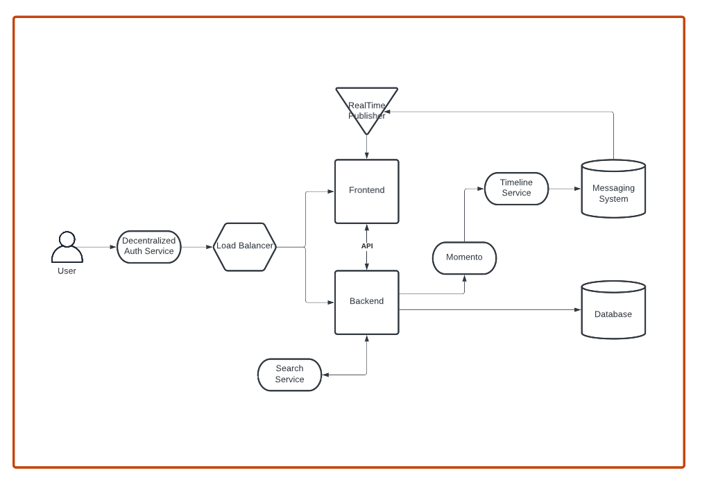
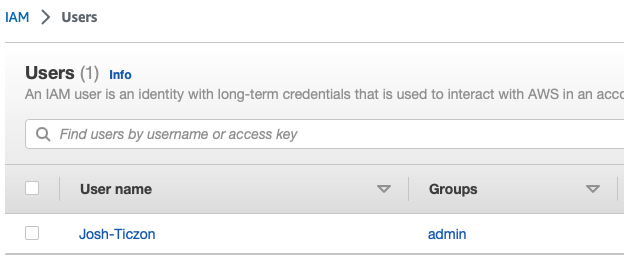
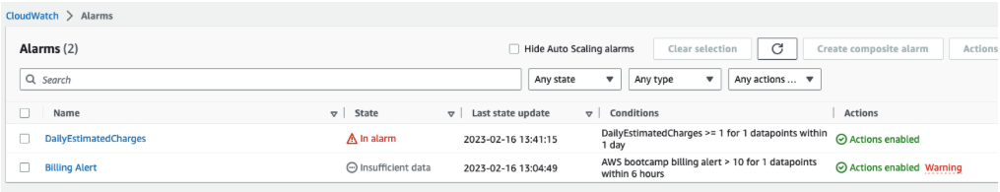
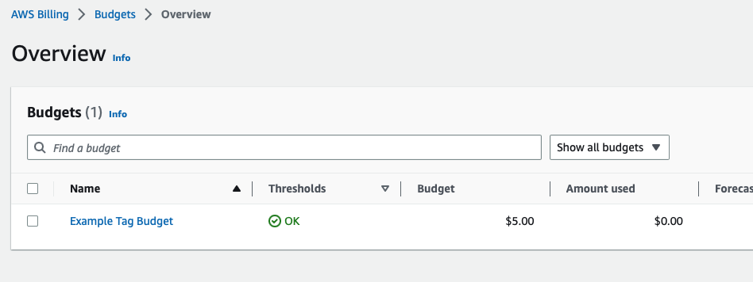
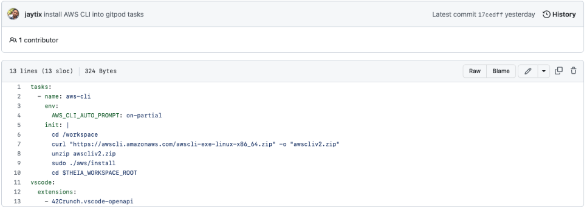
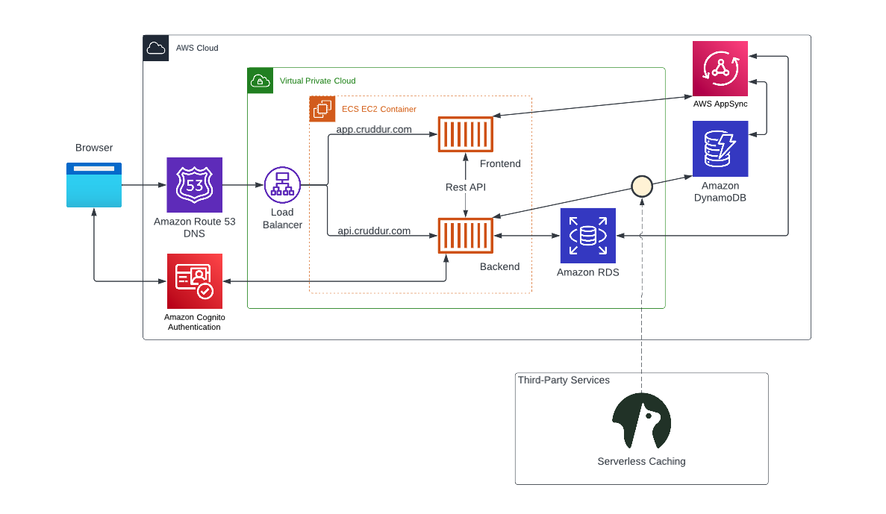

# Week 0 — Billing and Architecture

## Required Homework

### -Joined/watched live stream 2/11/23
### -Conceptual diagram created during livestream 2/11/23
proof of work, link to lucid charts and napkin design:
https://lucid.app/lucidchart/7070a637-d425-41b7-b970-e70377cacdee/edit?viewport_loc=-232%2C-491%2C2912%2C1465%2C0_0&invitationId=inv_11b31aec-f348-4455-a52a-c050c579d40e

### -Watched Chirag's video - spend considerations 2/14/23
### -Watched week 0 supplemental video - Generate Credentials, AWS CLI, Budget and Billing Alarm via CLI 2/15/23
### -Created an Admin user 2/15/23 
proof of work:

### -Created billing alarm during 2/15/23
proof of work: 

### -Created budget 2/15/23
proof of work: 
### -Cenerated AWS credentials 2/16/23
### -Used CloudShell 2/16/23
### -Installed AWS CLI in Gitpod 2/16/23
proof of work: 

### -Recreated Logical Architectural Diagram 2/16/23
proof of work and link:
https://lucid.app/lucidchart/48ac7635-e486-4f8b-b021-a2d92ade442c/edit?viewport_loc=73%2C288%2C2693%2C1303%2C0_0&invitationId=inv_1c4b2661-c170-4fb1-a304-8db1bb9e8b78

### -Completed billing quiz 2/16/23
### -Watched Ashish’s security video 2/17/23
### -Completed security quiz 2/17/23
