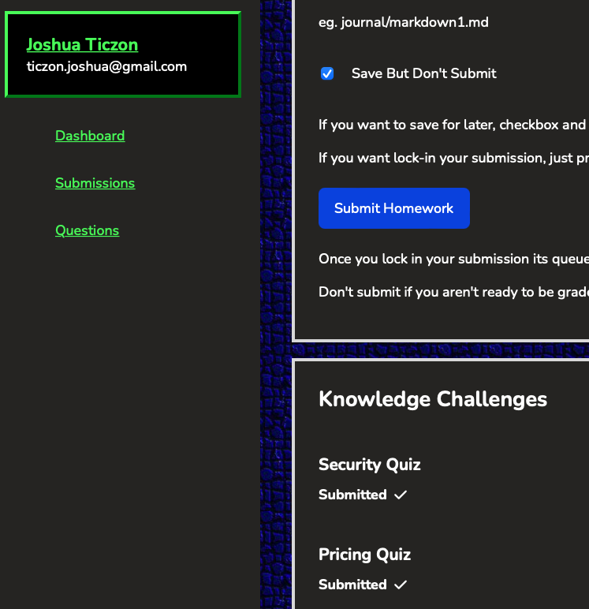

# Week 1 — App Containerization
react
-	Watched Week 1 - Live Streamed Video - 2/18
-	Watched Grading Homework Summaries - 2/20
- Watched How to Ask for Technical Help - 2/20

-	Containerize Application (Dockerfiles, Docker Compose) - 2/20

-	Document the Notification Endpoint for the OpenAI Document	- 2/20
-	Write a Flask Backend Endpoint for Notifications	- 2/20
-	Write a React Page for Notifications	2/20

-	Remember to Commit Your Code - 2/20
	
-	Run DynamoDB Local Container and ensure it works - 2/21
-	Run Postgres Container and ensure it works - 2/21

-	Watcked Chirag's Week 1 - Spending Considerations	- 2/23
-	Watched Ashish's Week 1 - Container Security Considerations - 2/23
-	Completed Quizzes - 2/23  
	
