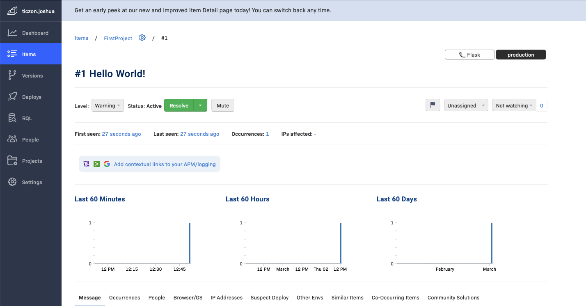

# Week 2 — Distributed Tracing

Required HW and proof

Watch Week 2 Live-Stream Video - 2/25

Instrument Honeycomb with OTEL - 2/28

Watched Ashish's Week 2 - Observability Security Considerations - 3/1

Instrument AWS X-Ray - 3/1

Configure custom logger to send to CloudWatch Logs - 3/2

Integrate Rollbar and capture and error - 3/2

Watch Chirag Week 2 - Spending Considerations - 3/3

