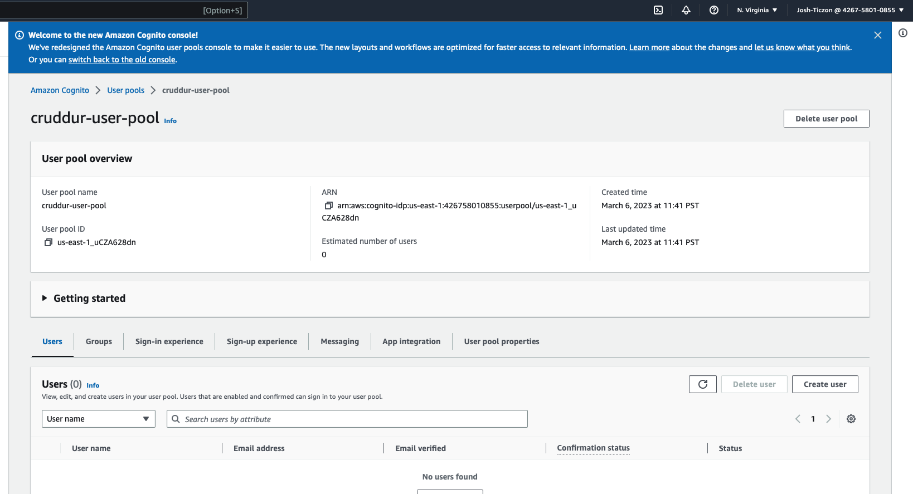
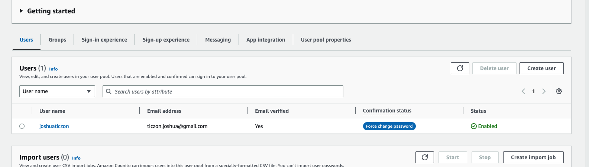
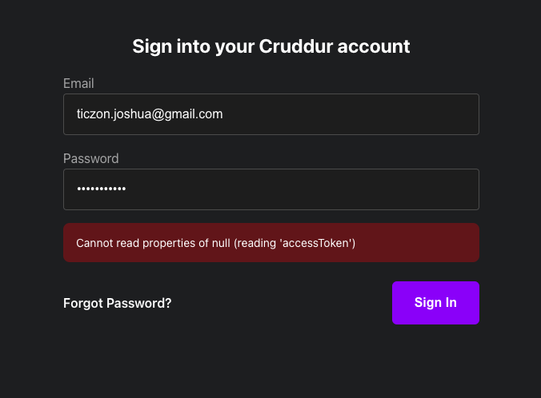
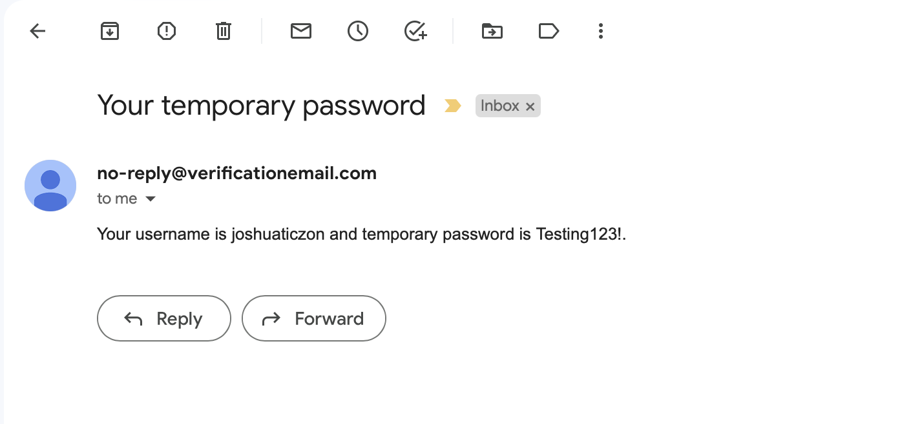
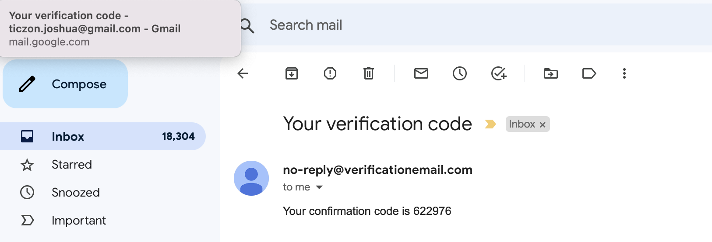
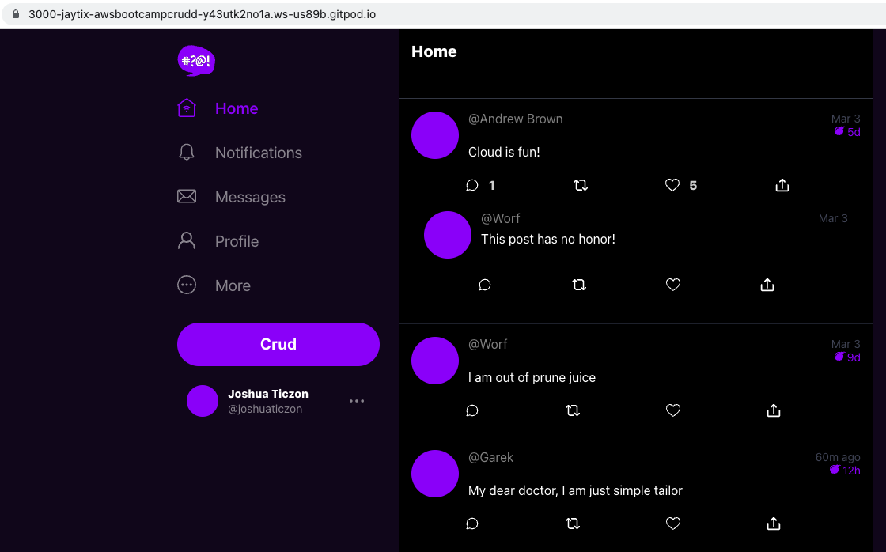
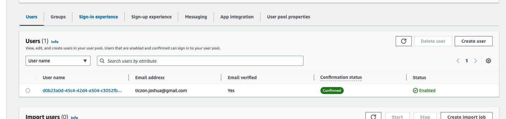
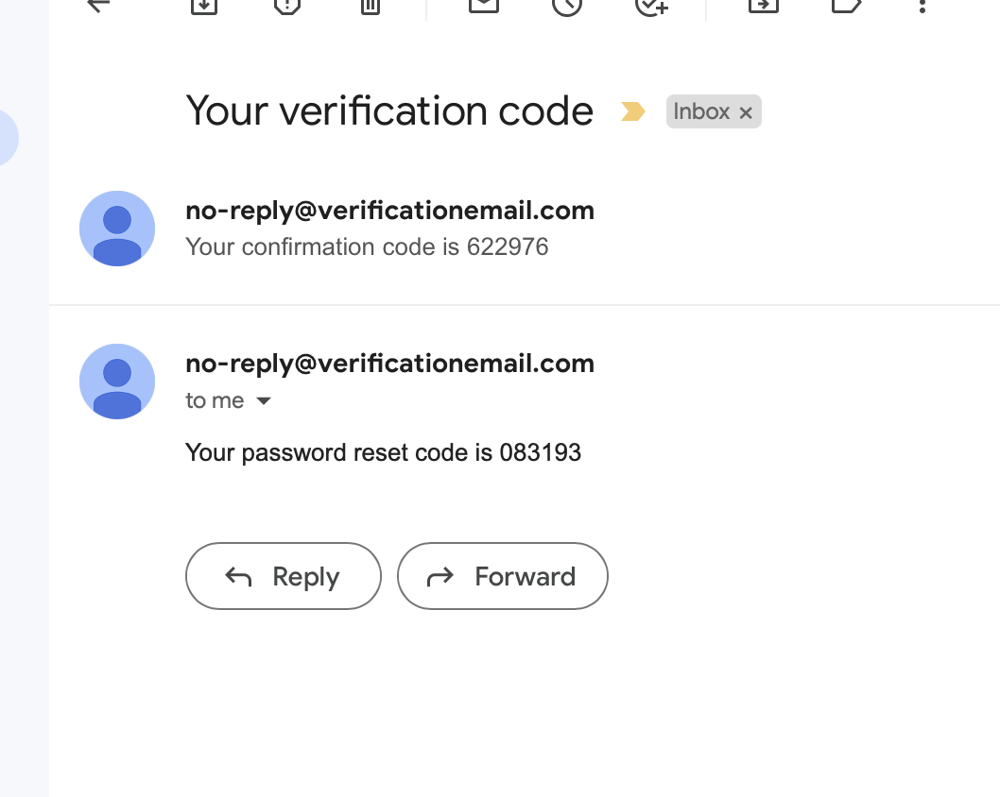
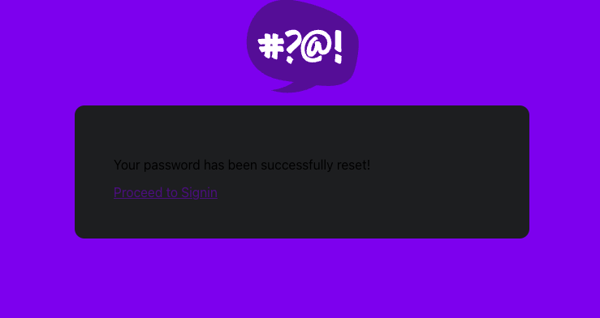
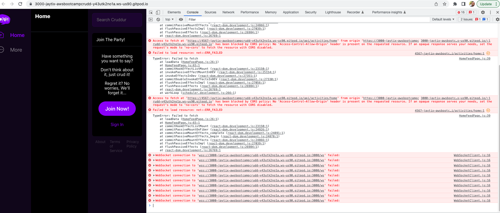

# Week 3 — Decentralized Authentication

Setup Cognito User Pool - 3/6

Implement Custom Signin Page - 3/6

Implement Custom Signup Page - 3/7

Implement Custom Confirmation Page - 3/8
Implement Custom Recovery Page - 3/8

Watch about different approaches to verifying JWTs - 3/9
- working on a fix for a CORs error that is not displaying data

Watched Ashish's Week 3 - Decentralized Authentication - 3/10
